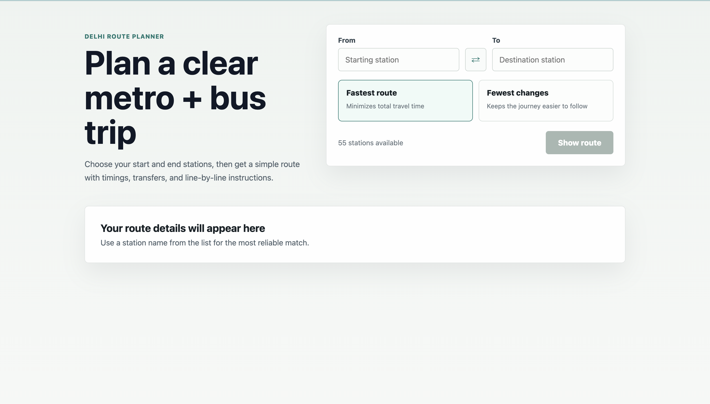
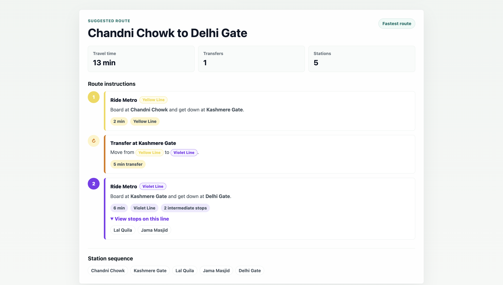

# Transit Route Planner

[]()
[]()
[]()
[]()
[]()
[]()
[]()

## Project Overview

A full-stack web application that computes optimal public transit routes between stations using graph algorithms. Users can choose between minimizing travel time or minimizing interchanges. Designed with extensibility in mind, the current scope handles multimodal routing, seamlessly integrating both metro and bus networks.

## Live Demo

- **Frontend Application:** [https://transit-route-planner-7e2r.onrender.com/](https://transit-route-planner-7e2r.onrender.com/)
- **Backend API:** [https://transit-route-planner.onrender.com](https://transit-route-planner.onrender.com)

## Features

### Frontend
- Clean, responsive user interface
- Station selection with dynamic optimization criterion selector
- Route visualization in a highly readable format
- Seamless REST API integration with the backend

### Backend
- High-performance REST API endpoints
- GET and POST route requests handling
- JSON request and response format
- Robust JSON-based transit network dataset parsing
- Docker support for easy deployment

## System Architecture

The application is structured into a separated frontend and backend to ensure scalability and maintainability.

| Component | Technology | Description |
| :--- | :--- | :--- |
| **Frontend** | React (Vite) | Single-page application serving the user interface. |
| **Backend** | C++17 | Core routing engine and REST API server built with Crow. |
| **Data Format** | JSON | Transit network dataset and API communication format. |
| **Build System** | CMake | Used for compiling and linking the C++ backend. |
| **Deployment** | Docker | Containerization for consistent backend deployment environments. |

## Algorithms & Data Structures

At the core of the backend is a highly optimized graph processing engine.

- **Data Representation:** The transit network is represented as a graph using adjacency lists to minimize memory overhead and speed up edge traversals.
- **Routing Engine:** A modified Dijkstra's algorithm computes the shortest path based on user-selected weights.
- **Priority Queue:** A min-heap priority queue is utilized to efficiently fetch the next most promising node during the graph traversal.

**Optimization Criteria Supported:**
1. **Least Travel Time:** Edge weights represent the time duration between stations.
2. **Least Interchanges:** Edge weights are dynamically adjusted to penalize line transfers.

## Project Structure

```text
transit-route-planner/
├── backend/
│   ├── CMakeLists.txt
│   ├── Dockerfile
│   ├── include/          # C++ header files
│   ├── src/              # C++ source files
│   └── data/             # JSON transit network dataset
├── frontend/
│   ├── package.json
│   ├── vite.config.js
│   ├── src/              # React components and logic
│   └── public/           # Static assets
└── README.md
```

## Getting Started

### Prerequisites
- Node.js (>= 14.x)
- C++17 compatible compiler (GCC, Clang, or MSVC)
- CMake (>= 3.10)
- Docker (optional, for containerized deployment)

### Backend Setup

1. Navigate to the backend directory:
   ```bash
   cd backend
   ```
2. Generate build files and compile the project:
   ```bash
   mkdir build && cd build
   cmake ..
   make
   ```
3. Run the executable:
   ```bash
   ./transit_route_planner
   ```

### Frontend Setup

1. Navigate to the frontend directory:
   ```bash
   cd frontend
   ```
2. Install dependencies:
   ```bash
   npm install
   ```
3. Start the development server:
   ```bash
   npm run dev
   ```

### Docker Setup

To run the backend within a Docker container:
```bash
cd backend
docker build -t transit-route-planner-backend .
docker run -p 8080:8080 transit-route-planner-backend
```

## API Endpoints

### Get All Stations

Retrieves a list of all available stations in the network.

**Endpoint:** `GET /stations`

### Calculate Route

Calculates the optimal route between a source and destination station.

**Endpoint:** `POST /route` (Also supports `GET /route` with query parameters)

**Request Body:**
```json
{
  "source": "Station A",
  "destination": "Station B",
  "criterion": "least_time" 
}
```
*Note: `criterion` can be either `"least_time"` or `"least_interchanges"`.*

**Success Response:**
```json
{
  "source": "Station A",
  "destination": "Station B",
  "criterion": "least_time",
  "found": true,
  "path": {
    "stations": ["Station A", "Station C", "Station B"],
    "segments": [ ... ],
    "totalTravelTimeMinutes": 15.0,
    "numberOfInterchanges": 1
  }
}
```

## Screenshots





## Future Improvements

While the current implementation focuses on metro and bus routing, the architecture is designed with further extensibility in mind. Planned improvements include:
- Incorporation of walking paths.
- Enhanced multimodal routing capabilities (e.g., ferries or suburban rail).
- Live transit updates and delay handling.
