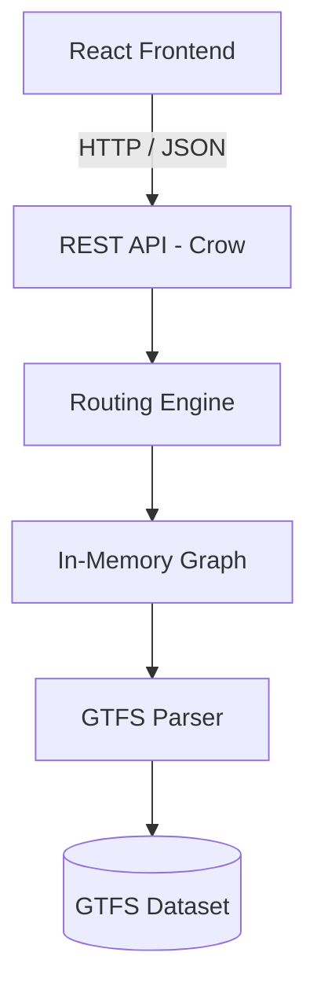
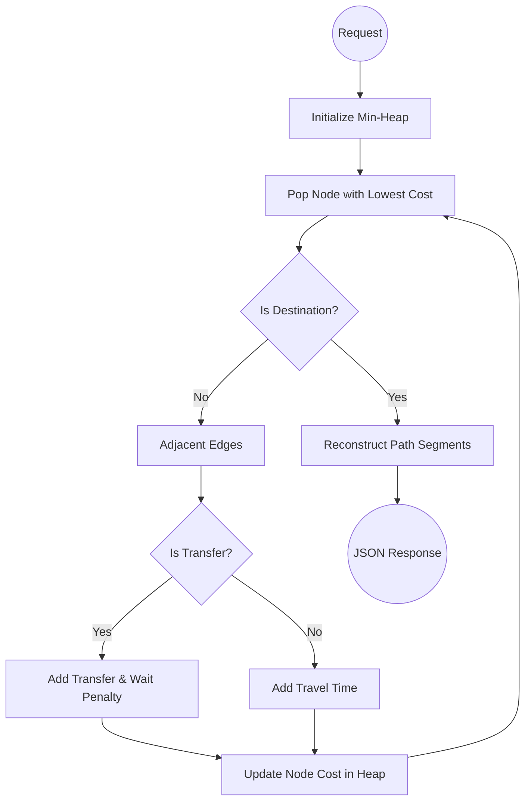

# Multi-Modal Transit Route Planner

<p align="center">
  
  
  
  
  
  
  
  
  
</p>

## Project Overview

This is a high-performance, full-stack **Multi-Modal Transit Route Planner**. Designed to process vast amounts of standardized transit data, it efficiently computes optimal routing paths across interconnected metropolitan transit networks.

At its core, the backend is powered by a custom routing engine built in modern **C++17**. It features a dynamic GTFS (General Transit Feed Specification) parser, a highly optimized memory-resident graph representation, and a custom Dijkstra-based routing engine exposed via a fast REST API using the **Crow** framework. 

The frontend provides a seamless user experience, built with **React** and **Vite**. It features a responsive UI, intuitive interactive route visualization, and dynamic city selection, all communicating flawlessly with the backend REST APIs.

## Core Features

- **Dynamic GTFS Discovery**: Supports multiple cities seamlessly. The engine automatically discovers and loads every city dataset placed inside the `data/gtfs/` directory at startup.
- **Multi-Agency Support**: Handles multiple GTFS providers per city (e.g., Metro and Bus networks) out-of-the-box.
- **Multi-Modal Routing**: Intelligently routes passengers using:
  - Metro networks
  - Bus routes
  - Automatically generated walking transfers
- **Advanced Optimization Modes**:
  - *Least Travel Time*: Optimizes for the fastest arrival.
  - *Least Interchanges*: Minimizes the number of vehicle transfers.
- **Geographic Stop Deduplication**: Automatically merges physically identical or extremely close transit stops across different datasets to form cohesive transfer hubs.
- **Dynamic Graph Construction**: The routing graph is constructed in memory entirely at startup. There are no hardcoded station lists, static networks, or database dependencies.
- **Haversine Walking Transfers**: Automatically calculates geographic distances between distinct transit hubs to generate feasible walking transfer edges.

## Architecture

The system is decoupled into a robust C++ backend serving data to a React frontend.



## Routing Engine

The routing engine relies on a carefully constructed **directed weighted graph**, where vertices represent transit stops and edges represent transit rides or walking paths. 

To compute the most optimal path, the engine uses a **Modified Dijkstra's algorithm**. Standard graph traversal is augmented with complex real-world transit rules:
- **Priority Queue**: A min-heap efficiently fetches the next most promising node to explore.
- **Route-State Tracking**: The algorithm tracks not just the current node, but the *transit line (route)* the passenger arrived on.
- **Transfer Penalties**: If moving to a new node requires a change in the transit line, an interchange penalty is applied dynamically.
- **Waiting Time Penalties**: Inherent waiting times for different modes of transport (e.g., waiting for a bus vs. a metro) are injected into the edge weights during traversal.
- **Multi-modal State Management**: Seamlessly evaluates trade-offs between walking, taking a bus, or taking a metro.
- **Route Reconstruction**: Once the destination is reached, the traversal history is efficiently reconstructed into human-readable segments (e.g., "Take Metro Line A to X, walk to Y, take Bus 42").



## GTFS Pipeline

The backend features a robust ingestion pipeline that directly parses raw GTFS archives. The pipeline reads the following standard files:

1. **`stops.txt`**: Extracts spatial coordinates and station metadata.
2. **`routes.txt`**: Maps route IDs to human-readable line names.
3. **`trips.txt`**: Links specific journeys to their overarching route.
4. **`stop_times.txt`**: The heaviest dataset, outlining the sequential stops and arrival/departure times for every trip.

**Processing Stages:**
- **Stop Deduplication**: Identifies stops with identical names or coordinates within a tight threshold and aggregates them to prevent fragmented graph clusters.
- **Edge Aggregation**: Rather than storing every single trip instance, the engine aggregates `stop_times` to compute the *average travel time* between adjacent stops.
- **Graph Generation**: Vertices are instantiated for every deduplicated stop, and directed edges are created for every aggregated transit link.
- **Walking Edge Generation**: A spatial pass calculates the Haversine distance between all proximal transit stops (across different routes or agencies) and generates pedestrian edges for those within a configurable walking threshold.

## Performance

The application is heavily optimized for speed and memory efficiency. Below are performance metrics from a production-equivalent workload:

| Metric | Value |
| :--- | :--- |
| **Supported Cities** | 2 |
| **Loaded GTFS Feeds** | 3 |
| **Raw Transit Stops** | 17,580 |
| **Transit Routes** | 2,475 |
| **Total Trips Processed** | 146,440 |
| **`stop_time` Records Parsed** | 4.57 Million |
| **Graph Vertices** | 7,584 |
| **Graph Edges** | 144,026 |
| **Generated Walking Edges** | 44,276 |
| **Graph Construction Time** | < 3 Seconds |
| **Avg. Routing Latency** | ~150 ms |
| **Worst-case Routing Latency**| ~326 ms |

## REST API

The backend exposes stateless REST endpoints returning structured JSON.

### Get Available Cities
**Endpoint:** `GET /cities`  
Returns a list of dynamically discovered cities.
```json
[
  "Delhi",
  "Paris"
]
```

### Get Stations
**Endpoint:** `GET /stations?city=<city_name>`  
Returns an alphabetical list of all transit stops in a specific city.
```json
[
  "Botanical Garden",
  "Châtelet",
  "Rajiv Chowk"
]
```

### Calculate Route
**Endpoint:** `GET /route?city=<city_name>&source=<source>&destination=<destination>&criterion=<criterion>`  
*Criteria: `least_time` or `least_interchanges`*

```json
{
  "source": "Rajiv Chowk",
  "destination": "Botanical Garden",
  "criterion": "least_time",
  "found": true,
  "path": {
    "stations": ["Rajiv Chowk", "Mandi House", "Botanical Garden"],
    "segments": [
      {
        "from": "Rajiv Chowk",
        "to": "Mandi House",
        "mode": "METRO",
        "route": "Blue Line",
        "duration": 5.5
      }
    ],
    "totalTravelTimeMinutes": 32.0,
    "numberOfInterchanges": 1
  }
}
```

## Repository Structure

```text
transit-route-planner/
├── backend/
│   ├── CMakeLists.txt
│   ├── include/          # C++ Header definitions
│   └── src/              # C++ Source implementations
├── frontend/
│   ├── package.json
│   ├── vite.config.js
│   └── src/              # React components, contexts, and styles
├── data/
│   └── gtfs/             # Root directory for GTFS datasets
│       ├── Delhi/
│       │   ├── bus/      # Delhi Bus GTFS
│       │   └── metro/    # Delhi Metro GTFS
│       └── Paris/
│           └── rer/      # Paris RER GTFS
├── docker-compose.yml    
└── README.md
```

## Getting Started

### Backend Setup (C++)
The backend requires a C++17 compatible compiler and CMake.

```bash
cd backend
mkdir build && cd build
cmake ..
make -j$(nproc)
./transit_route_planner
```
*The server will start on `http://0.0.0.0:8080`.*

### Frontend Setup (React/Vite)
The frontend requires Node.js (>= 20.x).

```bash
cd frontend
npm install
npm run dev
```
*The UI will be available on `http://localhost:5173` (or the port specified by Vite).*

### Docker Compose
For a seamless, one-click environment:
```bash
docker-compose up --build
```

## Configuration

Adding a new city requires **zero code modifications**. The backend dynamically scans the file system upon startup.

To add a new city (e.g., `London`):
1. Create a directory structure: `data/gtfs/London/<provider_name>/`
2. Drop the standard GTFS `.txt` files (`stops.txt`, `routes.txt`, etc.) into the `<provider_name>` directory.
3. Restart the backend server. The city will automatically appear in the API and Frontend dropdowns.

## Screenshots


*Figure 1: Clean, intuitive React user interface.*


*Figure 2: Optimal routing paths visualized dynamically.*

## Future Improvements

While the current engine is highly capable, the architecture is designed to accommodate further advanced transit concepts:

- **Time-Dependent Routing:** Leveraging GTFS schedules to calculate exact departures rather than frequency-based averages.
- **Real-Time GTFS-RT Support:** Ingesting live vehicle feeds for dynamic delay handling and rerouting.
- **A* Routing:** Implementing A* heuristics using spatial coordinates to further reduce graph traversal latency on massive datasets.
- **Service Calendars:** Supporting `calendar.txt` to distinguish weekday vs. weekend routing.
- **Fare Computation:** Integrating fare rules to allow users to optimize for the cheapest route.
- **Live Vehicle Positions:** Displaying real-time transit positions on an interactive map.
- **Accessibility-Aware Routing:** Providing paths that guarantee wheelchair accessibility (elevators/ramps).
- **Route Caching:** Utilizing LRU caches or Redis for frequent static route queries.